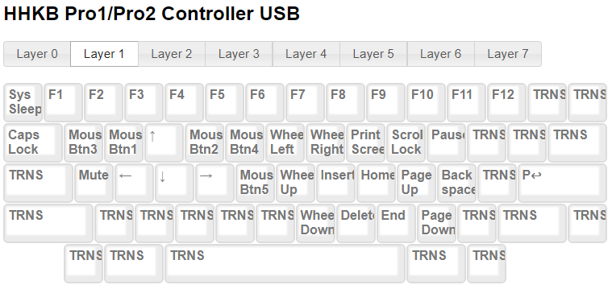

# HHKB 改造小记

## 前序

&emsp;&emsp;我之前买把 Filco minila 蓝牙版茶轴键盘. 我非常喜欢. 习惯了它的键位后感觉真的舒服, 配合着 vim 模式, 我找到了输入的快感. 但是, 公司最近要去不能再使用蓝牙设备. 正好赶上朋友在日本出差, 我就想让他帮忙买一把有线版的 minila . 但是, 日本没货... 当时, 脑门一热, 买 PFU 的 HHKB Pro2 吧.

&emsp;&emsp;在心急火燎的等待之后, 终于拿到了人生第一把静电容键盘. 迫不及待地回家拆箱, 挺漂亮的, 像一个干净素雅的邻家小妹. 插上电脑, 敲击, 感觉不错. 手感和茶轴不同, 像少女的肌肤一样弹性十足. 声音也比茶轴轻些. 等等, 这键位和普通键盘差异太大了. minila 的键位已经很有个性了, HHKB 还要特殊, 完全不适应. 但是, 为了信仰, 我还是强迫自己去适应它.

&emsp;&emsp;一个星期之后, 我的信仰崩塌了. 完全适应不来, 虽然我已经通过 DIP 将 HHKB 调整为适用 Windows 用户, 并配合 AtuoHotKey , 把删除, 退格键等都做了映射, 我还是没办法适应. 我习惯的 minila 的 Fn+; = Backspace, Fn+m = Delete 都没办法映射. 关键是 HHKB 的退格键(也是其特色) 在普通键盘的 \ 键位, 删除需要 Fn+`. 还有就是方向键, 太别扭了, Fn+[ = 上, Fn+; = 左, Fn+' = 右, Fn+/ = 右. 我的小手指不太灵活, 而且这键位设置不合理. 没法适应啊. 我想卖掉 HHKB 再买进一把 minila 有线版了.

&emsp;&emsp;我很不甘心, 在网上查了下, 发现有人用 hasu 大神的 HHKB Alt Controller 改造 HHKB, 把它变为可编程的 HHKB. 需要再花48美金... 我纠结了一晚上, 在加上闲鱼上挂出去键盘没人理会, 一咬牙下单了. 又是漫长的等待.

&emsp;&emsp;拿到 HHKB Controller 后, 我又迫不及待的按上了, 做工还是不错的, 缺点就是以前的控制板上有2个Usb 2.0 接口, hasu 的 Controller上没了. 这样在键盘上留下2个空洞, 好难受. 先暂时用胶带贴上吧.

## 改造

### 换 Controller

用螺丝刀把键盘后盖拆开, 就可以看到后盖上有个控制板, 通过线连接在键盘主板上. 小心的把线拆下来. 然后把控制板的一个螺丝拧下来, 换上 hasu 的 Controller, 尺寸正好. 然后插上线, 合上盖子, 拧上螺丝, 一切OK.

### 编程调整键位

* [TMK Keymap Editor](http://www.tmk-kbd.com/tmk_keyboard/editor/index.html) 中选择 Controller 下的链接就可以进入编辑界面.
* 默认加载了和 HHKB 一样的键位设置.
* Editor 中支持 Layer 0 ~ 7, 共8层. 但是, 大部分人用不到这么多. 我暂时用到了3层.
* 在编辑完成后点击编辑页面下方的 "Download" 按钮, 下载固件, 默认名称为 unimap.hex.
* 我的[配置](https://goo.gl/vgf5RA), 短连接需要翻墙, [长链接][1] 试试.
* 我主要是把 HHKB 的键位改成 minila 一样的键位了, 就是 Fn+ E S D F 是上 左 下 右. Fn+m = Delete, Fn+; = Backspace.

#### Layer0

初始层, ; + LT2 是修改 ';' 键的编码为 "ACTION_LAYER_TAP_KEY ; Layer2"

#### Layer1

左 Fn 按下时切换

#### Layer2

长按 ; 时切换. 可以长按 ; + i j k l 移动鼠标

### 烧录固件 Windows版

* 电脑上安装 [Atmel Flip](http://www.microchip.com/developmenttools/productdetails.aspx?partno=flip)
* 键盘连接到电脑上, 电脑会检测到 HHKB mod, 并安装好驱动. 在原来 DIP 的位置有一个红色的按钮, 是 hasu HHKB Controller 的编程模式按钮. 按下去, 设备管理器中会显示"无法识别 ATmega32U4", 右键点击, 菜单中选择更新驱动, 然后在 "手动搜索并安装驱动"的弹出框中选择 Atmel Flip 的安装目录, 系统自动安装驱动.
* 启动 Atmel Flip.
  * 点击菜单中的 Device --> Select (Ctrl+S) (或者快捷菜单栏上的第一个按钮: Select a Target Device), 在弹出框中选择 ATmega32U4后确定.
  * 点击菜单中的Settings --> Communication --> USB (Ctrl+U)( 或者快捷菜单栏上第二个按钮: Select a Communication Medium), 在弹出框中点击 "Open" 按钮
  * 此时, 界面上不再是不可编辑状态. 点击菜单中的 File --> Load HEX File (Ctrl+L), 在弹出框中选择前面下载的 unimap.hex 文件.
  * 依次点击 "Run", "Select EEPROM", "Start Application" 按钮.
* 感受输入的乐趣吧.

## 吐槽

> 个人感觉 HHKB 键盘是被过度神话了. 太另类的键位, 关键是并不好用, 完全不值得去适应. 这真的是最后一把静电容键盘了. 如果没有 hasu 的 Controller, 我肯定会把它卖掉了. hasu 的 Controller 给 HHKB 美丽的外表下赋予了有趣的灵魂. 我很庆幸买了把无刻的 HHKB, 不然还要折腾键帽了.

[1]: <http://www.tmk-kbd.com/tmk_keyboard/editor/unimap/?hhkb#456C4oOW4Kmg6biL5oKGcOOOiNeA5rWMxoDjkr/suIDrg6DirI7GsO6Au+C4gOeDoOKcjsiy7rOz4rCE7IuA7LCv4bOE6IGd4bOp6amW5o2Z67Wm5LS67pOh7Y635Lm946yU7pmT6pWO45S77ZOk7J6u4buM5J6h7reH6bye7JG56Yep5J6N4bu056S04oGQ652C57SL4ZCj4pCk6pCi6py04p6k4oml7JCk4ZWV4oew7oSm4oSj4oSh7Z2T7IuI4p+H44eO7KCv7Kiu7K+M4qyu4qKt4qKv4qat7LSW4qSj7piu5YuW7Yim5pCJ6oqg7K6W44eF5Yy3452G4rKX4pax5oKd6oOl6pui6o6S7Iqn7Z+o5bC26peC6o+i6pii6piV4Zuu5aOf5aOk5aC75r6U5ayl6oGR5a+Q5bKw6by87KmT66Oi5L6h4oGn45yl7Jyg7pym7oyY5YaI7pCy46SS6LmB6ouR7qGs5YiU6IqP5Jyh44OM6omX6Zmb7IS34YKQ46uU4rqM6Imt5YuB5ZWq7JKi6YSg6YmJ4q+U4qek6bKZ4qyh7ISY5oqZ6ryh4YOV4buK5pWM7qKz56ai7IOC65en7KWO4qiV64+R5o+H44aK76qo7J6O6JWp55q64rWu4a2u4aKp7oG144yz4peM6bWH4r2R6LuX7qyx6Imd5qal6YqL45ma6LaG6q2t67OW4o62466R4Lqj5Y6g7ZuL55q77rWe7L2L25PuoI3vqK3ohpDvvrftnqvgsobstpHvg4HroLvhooznqqPGmO+Jq+W8m+S9muOMieuji+qcvuy1jOKci+mmoO25pOuineGGl++Ope+LtOesu+W7t+WYi++XvO+FvOObnOyxt+O2rOyrg+edle25jOC6neSPkOytoeuIu+uRjuWNo+qLkuams+W+nuObu+y2qu+LqueVr+W1u+Odte2Xq+eWkNey>
